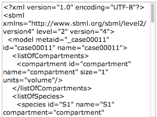
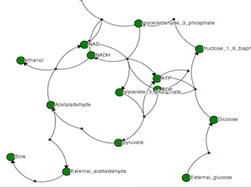
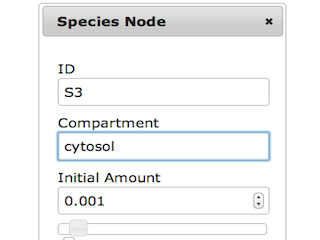
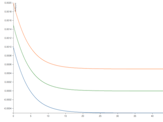



        
        
    
        

**node-sbml** is a bio-model viewer, editor, and simulator that allows scientists to quickly view and manipulate SBML models through the browser.   

**Updates**
------------------------------------

<ul class="posts">
  
    <li>{{ post.date | date_to_string }} &raquo; <a href="{{ BASE_PATH }}{{ post.url }}">{{ post.title }}</a></li>
  
</ul>
